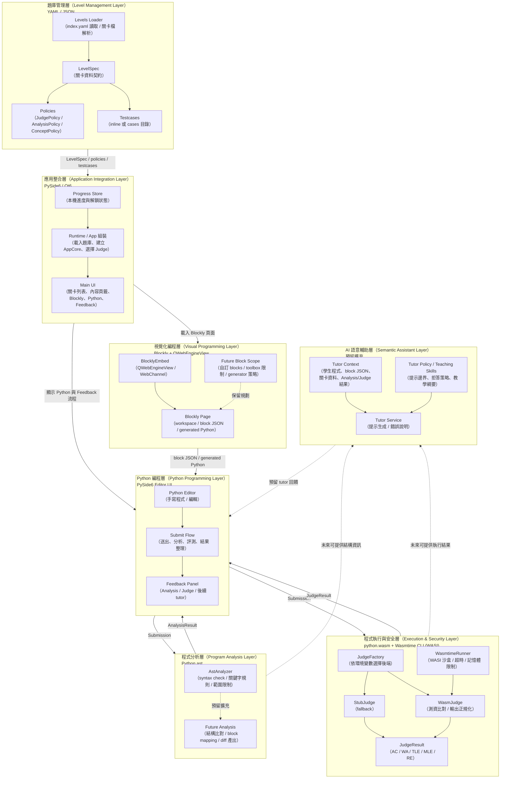

# 系統架構圖（System Architecture Diagram）

> 依據 [技術策略說明文件](../technical_rationale.md) 與目前整併後的 MVP 架構整理
> 更新日期：2026-03-12

## 系統架構圖（圖片版）

## 分層元件圖（Layered Component Diagram，互動版）

## 各層職責摘要

| 層別 | 核心技術 | 主要職責 |
|------|----------|----------|
| 應用整合層 | PySide6 / Qt6 | 啟動 runtime、組裝 `AppCore`、載入題庫、串接 UI 與本機進度 |
| 題庫管理層 | YAML / JSON / PyYAML | 載入 `index.yaml`、解析關卡、組裝 `LevelSpec`、政策與測資 |
| 視覺化編程層 | Blockly + QWebEngineView | 提供 Blockly workspace，輸出 block JSON 與 generated Python；自訂 blocks 與限制策略屬後續規劃 |
| Python 編程層 | PySide6 Editor UI | 提供 Python 編輯、送出、結果呈現與主互動流程 |
| 程式分析層 | Python `ast` | 目前以 syntax check、關鍵字規則、範圍限制為主；更深的結構分析屬後續擴充 |
| 程式執行與安全層 | python.wasm + Wasmtime CLI (WASI) | 以 WASI 沙盒執行 Python、做測資比對、正規化、超時與記憶體限制；wasm 不可用時 fallback 至 `StubJudge` |
| AI 語意輔助層 | 待定 provider + teaching skills | 保留給 tutor、提示策略與教學綱要整合；目前屬預留擴充層 |

## 資料流說明

1. **題庫載入**：啟動時由題庫 loader 讀取 `assets/levels/index.yaml` 與各關卡檔，組成 `LevelSpec`、政策與測資資料，交由 runtime 與 `AppCore` 使用。
2. **Blockly 互動**：Blockly 透過 `QWebEngineView` 與 WebChannel 嵌入桌面 UI，輸出 block JSON 與 generated Python，供主介面接收。
3. **Python 提交**：學生在編輯區撰寫或調整 Python 程式後送出，形成 `Submission` 進入分析與評測流程。
4. **分析流程**：目前先以 AST syntax check、關鍵字規則與範圍限制為主；若後續需要更深的結構驗證，再在此層擴充。
5. **評測流程**：`JudgeFactory` 依環境變數選擇 `WasmJudge` 或 `StubJudge`；`WasmJudge` 再透過 `WasmtimeRunner` 執行 `python.wasm` 並完成測資比對。
6. **結果回饋**：Analysis 與 Judge 結果回到主 UI，呈現在 feedback 區，並影響關卡解鎖與進度保存。
7. **AI 預留接點**：未來若引入 tutor，將以學生程式、block JSON、關卡資料與 Analysis/Judge 結果組裝 tutor context，產生提示與錯誤說明。
