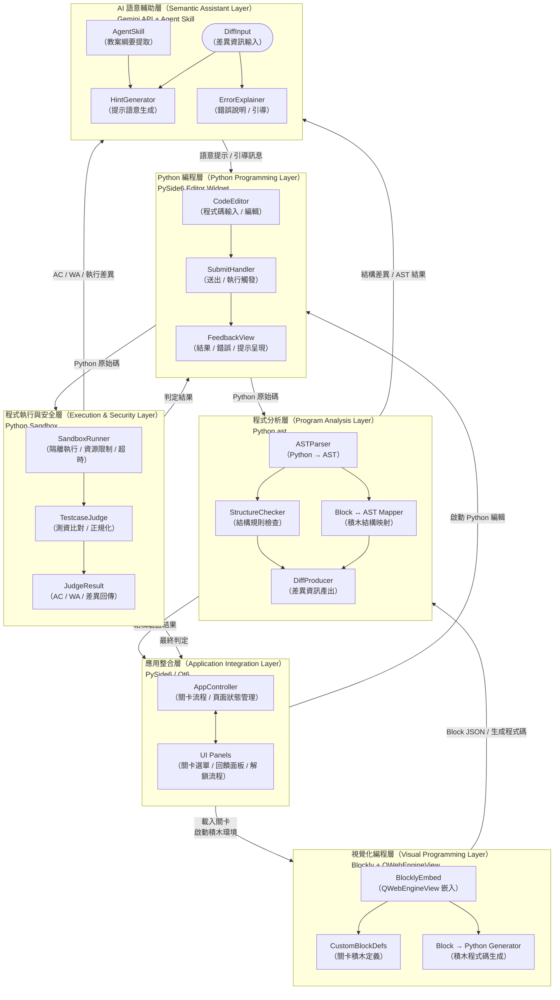

# 系統架構圖（System Architecture Diagram）

> 依據 [技術策略說明文件](../technical_rationale_document.md) v0.1 繪製  
> 更新日期：2026-03-03

## 系統架構圖（圖片版）

## 分層元件圖（Layered Component Diagram，互動版）

## 各層職責摘要

| 層別 | 核心技術 | 主要職責 |
|------|----------|----------|
| 應用整合層 | PySide6 / Qt6 | 關卡流程控制、頁面狀態管理、模組整合 |
| 視覺化編程層 | Blockly + QWebEngineView | 積木操作、自訂積木定義、積木→程式碼生成 |
| Python 編程層 | PySide6 Editor Widget | 程式碼編輯送出、結果與回饋呈現 |
| 程式分析層 | Python `ast` | AST 解析、結構規則檢查、積木↔AST 映射、差異產出 |
| 程式執行與安全層 | Python Sandbox | 隔離執行、測資比對、AC/WA 判定、超時控制 |
| AI 語意輔助層 | Gemini API + Agent Skill | 差異語意轉換、學習提示生成、錯誤說明引導 |

## 資料流說明

1. **積木 → 分析**：Blockly 輸出 Block JSON 或產生 Python 程式碼，送至程式分析層進行結構映射與驗證。
2. **Python → 執行**：學生送出程式碼後，沙盒執行並以測資比對取得 AC/WA 判定。
3. **差異 → AI 引導**：程式分析與執行層產出的結構差異與執行錯誤，輸入 AI 層轉為可理解之學習提示。
4. **提示 → 回饋呈現**：AI 語意提示回傳至 Python 編程層的回饋面板，呈現給學生。
5. **流程控制**：應用整合層統籌關卡解鎖與流程推進，接收驗證結果後決定是否進入下一關。
