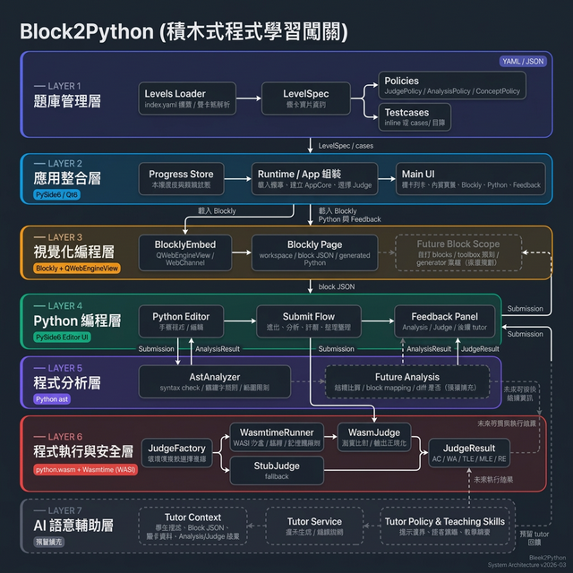
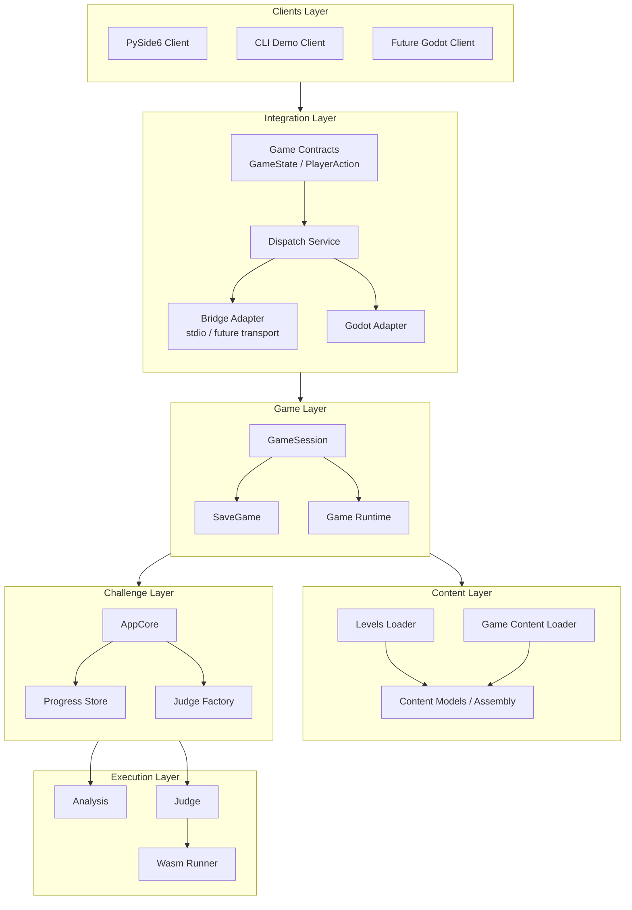
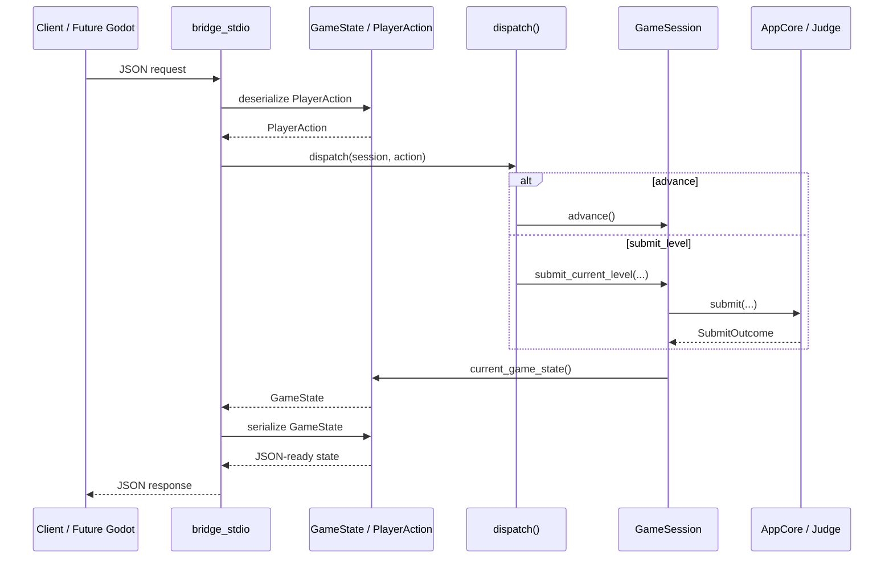

# 系統架構圖

> 更新日期：2026-03-18
> 相關文件：[technical_rationale.md](../technical_rationale.md)

## 架構總覽

## 分層元件圖

## Action Flow

- client 只送 `PlayerAction`
- dispatcher 只做 action 到 session 的轉接
- `GameSession` 負責真正的流程推進
- `bridge_stdio` 只負責 JSON stdin/stdout 運輸

## Package 對照

| Package | 角色 |
|---------|------|
| `block2python.clients` | PySide6 與 CLI consumer |
| `block2python.integration` | 對外 contract 與 bridge 邊界 |
| `block2python.game` | 遊戲主流程控制 |
| `block2python.content` | levels 與 game content 載入 |
| `block2python.level_play` | level submit 與 progress 子系統 |
| `block2python.analysis` | 靜態分析服務 |
| `block2python.judge` | judge 實作與 Wasm 執行 |

## 目前狀態

目前已完成：
- `level_play/`、`content/`、`game/`、`integration/`、`clients/` 骨架
- `game/` 內的 `GameSession`
- `level_play/` 內的 `AppCore`
- `content/` 內的 loaders
- `clients/` 內的 PySide6 與 CLI wrapper
- `app/` 與 `game_content/` 的相容 shim

目前僅預留、尚未完整實作：
- 正式 `integration/contracts` models
- dispatcher logic
- stdio bridge server
- Godot adapter 行為

## 架構解讀

- `GameSession` 是預定的遊戲主入口。
- `AppCore` 是 challenge 子系統，不是整個遊戲總控。
- `integration/` 是外部前端應依賴的正式邊界。
- `clients/` 是 consumer，不應定義遊戲模型本身。
- `app/`、`game_content/`、`ui/` 是過渡期保留的相容路徑。
